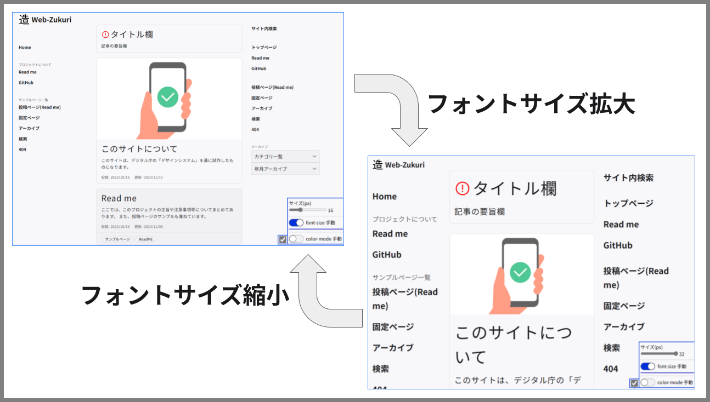
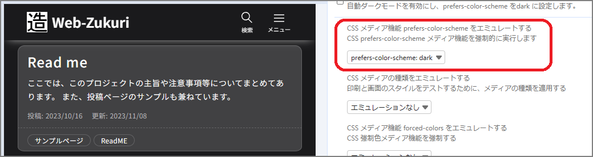
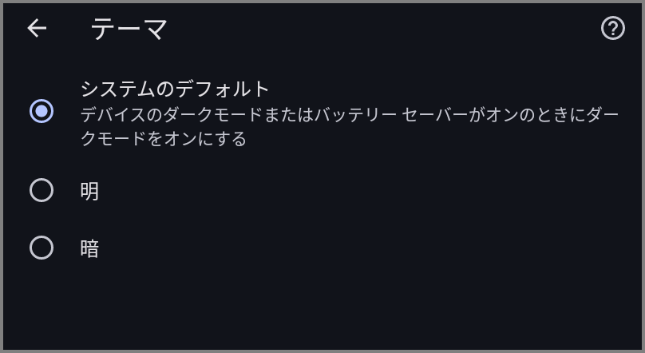
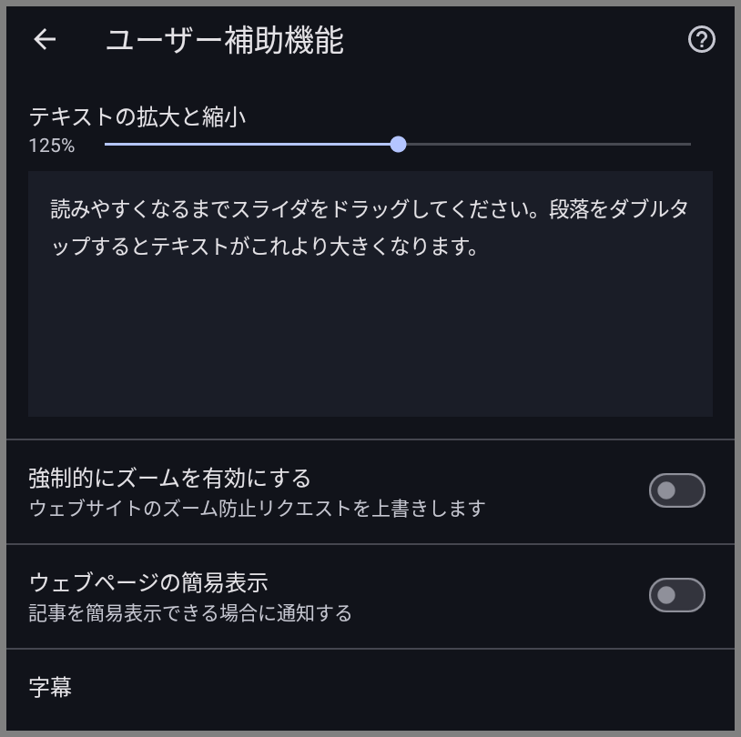
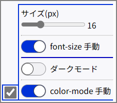
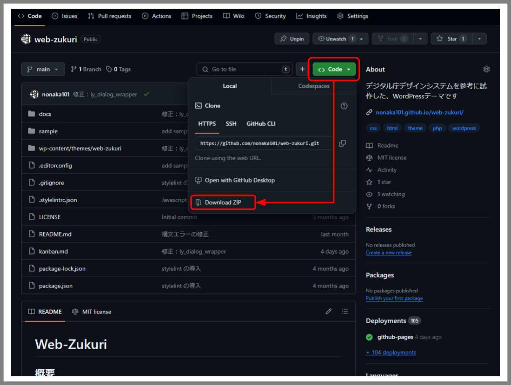
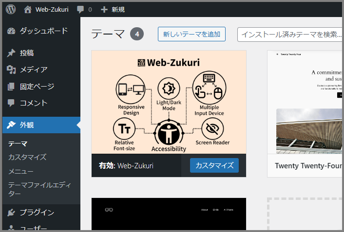
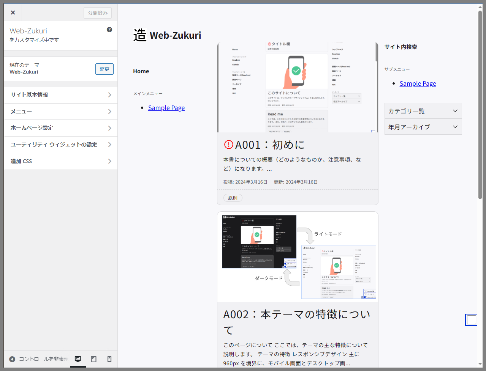
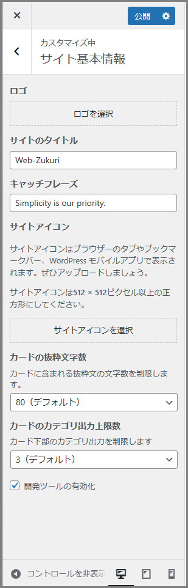
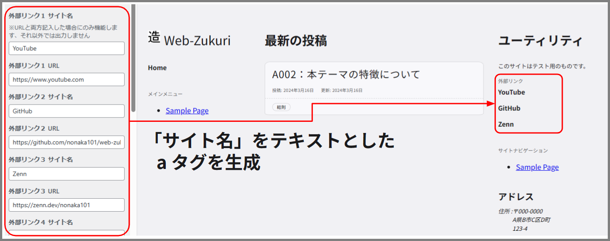

# Web-Zukuri

## 概要

こちらは、[デジタル庁デザインシステム](https://www.digital.go.jp/policies/servicedesign/designsystem) を参考に試作した WordPressテーマです。`Version 1.3.2`（2023年6月29日に公開されたもの）を主軸として作成しています。  
どのようなものかについては、[GitHub Pagesを使ったサンプルページ](https://nonaka101.github.io/web-zukuri/) をご覧ください。

作成の際の考えにつきましては、 [Zenn](https://zenn.dev/nonaka101) にて備忘録を作成しましたので、そちらを御覧ください。

### 現状について

現在、**作業途中**となっております。

アクセシビリティについてはまだ勉強中もあり、その都度反映するかもしれません。WordPress 側については、もう少し何とかできそうな箇所の改善を目指しています。

- [ ] : index.php の作成（多様な状況に対応できるように）
- [ ] : functions.php の整理
- [ ] : ブロックテーマ関係（theme.json やエディタ関係、自作ブロックなど）

コメント機能など、下記の機能についてはまだ導入できるか不明な状態です。  
一度完成してから考えようと思っております。

- [ ] : コメント機能
- [ ] : カスタムタクソノミー
- [ ] : パンくずリスト

## 目的

WordPressの学習用として作り始めましたが、Webアクセシビリティの考えを取り入れられればと考えてます。

## 特徴

### レスポンシブデザイン

主に 960px を境界に、モバイル画面とデスクトップ画面の切り替えが行われます。

デスクトップ画面

モバイル画面（縦）  

モバイル画面（横）  

本テーマでは[フォントサイズが固定でない](#フォント等のサイズに-rem-を採用)のもあり、比較的単純な構成になっております。

### デジタル庁デザインシステム（Ver 1.3.2）を参考に作成

本テーマは、デジタル庁が公開している「[デザインシステム](https://www.digital.go.jp/policies/servicedesign/designsystem)（Ver 1.3.2）」をベースに試作したものになります。

その上で、自身の検証や WordPress に落とし込む際の工夫として、後述する様々な調整を加えています。

#### カラーモードに対応

このテーマでは *ライト↔ダーク*間で、モードを切り替えることができます。カラーモードに関しては、ブラウザ（OS）による設定を反映します（※）。

これによりユーザーが見やすい、集中しやすい色感で、サイトを閲覧することができます。

（※ 後述する[開発ツール](#開発用のツール)でも行うことができます）

#### フォント等のサイズに `rem` を採用

テキスト要素を中心に、相対単位の `rem` を使うようにしています。`rem` を使うことで、ブラウザ（OS）側で設定されたフォントサイズを使用できます（※）。

これによりユーザーがそれぞれの事情に適したサイズ感で、サイトを閲覧することができます。

（※ 後述する[開発ツール](#開発用のツール)でも行うことができます）

#### その他のアクセシビリティ要素

本テーマは他にも、様々な箇所でアクセシビリティを向上させるよう努めています。

- アイコンボタンへのラベル付与
- モーダル化するメニューに `dialog` 要素を使用
- ブロックスキップの採用
- 見出し要素やランドマーク要素の構造に配慮

### 開発用の機能

こちらはテーマを使用する方というより、テーマを開発する方向けの特徴になります。

#### 開発用のツール

本テーマでは、その特徴として「フォントサイズ」「カラーモード」を変更することができます。本来、これらを検証するためにはブラウザもしくはOSの設定を都度変更しなければなりません。

ブラウザの開発者ツールを使って、カラーモードを切り替えることができる（Edgeの場合は レンダリング のタブにある）

Chrome（Android）で変える場合、ブラウザの「設定」→「テーマ」から行う

Edgeでは「設定」画面からフォントサイズを切り替えられる

Chrome（Android）で変える場合、ブラウザの「設定」→「ユーザー補助設定」から行う

これら 2項目を画面内で検証できるように、本テーマでは開発ツールを用意しています。[GitHub Pagesによるサンプル](https://nonaka101.github.io/web-zukuri/) では、**画面の右下**にあるボックスがそれになります。（WordPressで導入した際には、カスタマイズ画面から表示/非表示を切り替えられます）

ここではフォントとカラーモードに関し、JavaScriptによる手動モード機能を搭載しています。開発ツールでは「それらの機能を有効化するか（もしくはブラウザ設定のままにするか）」に加え、「フォントサイズをいくつにするか」「ライトとダーク、どちらのモードを使うか」等を設定できるようになっています。

#### CSS設計の参考として `PRECSS` を使用

本テーマのCSS設計は、[PRECSS](https://precss.io/ja/)を参考としており、コンポーネントに応じた分類やクラス設計を行っています。

ですので「新しいコンポーネントを作りたい」「既存のコンポーネントを改造したい」といった際に、運用しやすくなるよう努めております。

## 導入方法

導入は、下記の手順に従って行います。

1. リポジトリのダウンロード
2. WordPress の `themes` フォルダへコピー
3. 管理画面からテーマを選択
4. （オプション）カスタマイズ画面から各種設定

### リポジトリのダウンロード

本リポジトリをダウンロードしてください。`clone` で使っても良いですし、ちょっと触るくらいでしたら下図のように `zip` でダウンロードして問題ないです。

テーマを試すだけでしたら、`web-zukuri/wp-content/themes/web-zukuri/` のデータのみで十分です。

### WordPress の `themes` フォルダへコピー

WordPress の `wp-content/themes/` 内が、テーマを管理している場所です。ここに先程のテーマフォルダ `web-zukuri` をコピーしてください。

これで、問題がなければ WordPress 上に認識されるはずです。

### WordPress 管理画面上から、テーマを選択する

WordPress の「テーマ」から、`Web-Zukuri` を有効化します。

### カスタマイズ画面で各種設定（オプション）

ここからはテーマカスタマイザーを利用した設定を行います。これはオプション項目であり、設定を行わなくてもテーマは問題なく動作します。

ここでは、下記の設定について説明します。

- 開発ツールの出力設定
- カードの出力設定
  - カテゴリ数
  - 要旨の文字数
- ユーティリティウィジェットに関する各種設定
  - テキストエリア
  - （メール等）連絡先の入力
  - コピーライト文

まずは管理画面から、「カスタマイズ」を選択しカスタマイズページへ移動します。

テーマカスタマイザーを起動した状態

ここでは WordPress がデフォルトで用意している内容もありますが、テーマ独自の内容のみを取り上げていきます。

#### 「サイト基本情報」セクション

ここでは、WordPress デフォルトの項目に加え、２つの要素が追加されています。

##### 開発ツールの出力設定

これは検証用の開発ツールを出力するかの設定です。チェックを入れると、画面右下に開発ツールが出力されます。

詳細については第一章にて説明しますが、これはカラーモードやフォントサイズを画面内で変更し、きちんと問題なく表示できているかを確認するためのものになります。

ユーザーが使うものではなく あくまでデバッグ用なので、もし本テーマを利用してサイトを公開する場合には、この設定は切ることを強く勧めます。

##### カードの出力設定

これは「フロントページ」「アーカイブページ」「検索ページ」で使用される**カードコンポーネント**に関する設定となります。

まずは「カテゴリ数」ですが、これはカード下部にあるカテゴリリストの要素数を制限します。

本来、投稿記事にはカテゴリを複数設定することができます。カードコンポーネントではそれらを出力し、該当するカテゴリへのリンク（アーカイブページ）を付与してくれます。

しかし10や20も設定してしまうと、カードの構造として歪になるだけでなく、スクリーンリーダーでの読み上げに時間がかかってしまうことが予想されます。またキーボード操作に関しても、Tabキーを押す回数が増えてしまうことでしょう。つまりカテゴリリンクが過剰に出力されることは、目的とする箇所への到達を妨げる要因となり得てしまい、望ましい状態ではないということです。

この設定は その上限数を決めるものです。仮に投稿記事に10以上のカテゴリが設定されていたとしても、ここで 3 と設定した場合は、3つのみが出力されます。0 にした場合は、カテゴリリスト自体を出力しません。

次に「要旨の文字数」ですが、これはカード中央にある要旨のテキスト量を調整します。

カテゴリ同様、投稿記事には要旨を設定することができます。（※）  
（※ 本テーマにおいては、*要旨が設定されていない場合*は本文を要旨として扱います）

本設定では、この要旨文のテキスト量を制限するものです。もし設定より文量が多い場合は、`...` として省略されます。0 にすると、要旨自体を出力しません。

この設定の目的ですが、カテゴリにも登場した スクリーンリーダーへ配慮するためです。要旨は記事内容へのアタリをつけるうえで非常に有用ですが、文量が多くなってしまうと読み上げるのに時間がかかってしまいます。本テーマでは本文を要旨として使うこともあるので、不用意に長くならないようここで設定するようにしています。

#### 「ユーティリティ ウィジェットの設定」セクション

ここでは、フッターにあるユーティリティウィジェットに関する設定を行います。

##### テキストエリア

ここではテキストエリアに載せたい内容を記載します。設計段階では、「サイトに関する備考や注意事項」「筆者の紹介文」等を載せることを想定しています。

##### 各種連絡先、コピーライト文

ここではメール、電話番号、外部URL等の連絡先を記載します。

メールや電話番号は、入力した際に項目を出力するようしています。外部URLはリンク要素となる関係から、名前とURL両方の入力があって出力するようにしています。

また最後のコピーライト文は、サイト最下段にあるコピーライトを記載するためのものになります。

## 注意

ここでは、本テーマに関する注意事項等を説明しています。

### 試作段階であることを ご留意ください

「とりあえず動作する」という試作レベルであり、一般的な製品グレードに達していないことは ご留意ください。

色々と初めての試みなので、至らない箇所が多々残っています。例えば下記の要素について、まだ不完全な状態です。

- ブロックエディタへの対応
- コメント等の、WordPressに備わっている機能への対応
- アクセシビリティの検証
- セキュリティの向上
- コードの効率化

致命的な誤り等はないよう努めていますが、もし何かありましたらご指摘いただけるとありがたいです。私自身 勉強中の身なので、いずれ改善していければと考えています。

### 「導入すればアクセシビリティを達成できる*ものではない*」ことをご了承ください

投稿するコンテンツにも、アクセシビリティへの配慮は必要となってきます。例えば下記のような取り組みです。

- 画像に `alt` を設定する
- 多色のグラフは、パターンを使う
- 適切な見出し要素を使う

### その他、現段階でわかっている問題点

#### 古いブラウザでは動作が怪しいです

古いブラウザにおいては、CSSやHTMLの新機能の関係で、レイアウトが崩れているかもしれません。  
ベンダープレフィックスを使う などの回避手段を少しずつ反映させていっていますが、完成の方を優先しているため対応が遅れております。ご了承ください。

#### ブロックテーマに関する知見が不足しており、テーマを適合させる方法が未解決の状態です

ブロックエディタで作成したコンテンツを、どのようにテーマの中に受け入れるかについて上手い解決法が思いついていない状態です。  
最終的には WordPress のブロックエディタよる投稿に対応させることを目標にしておりますが、現在は暫定的な対応（あるいは未解決状態のまま）になっています。

- カラーモード切り替えによるコントラスト比の問題が起きるのではないか？
- カラムブロック等のレイアウトに関するブロックが上手く調整されるか？
- 機能の関係上、フォントサイズは `rem` を使うのが望ましいが、それは `theme.json` で設定すべきなのか css で個別に設定しなければいけないのか？

#### CSS設計が参考元とは少し変わっています

CSS設計に `PRECSS` の考え方を使っていますが、厳密なルールに則っていない状態です。（例：省コード化のためにネストしたセレクタを使い詳細度を高めている、など）

モジュール等の各要素には簡易的なコメント文を入れておりますので、どのように使っているかについてはそちらをご参照いただくか、[Zennでの備忘録](https://zenn.dev/nonaka101)を参照してください。

## 参考資料について

作成に際し、参考にさせてもらった資料です。

### デザイン関係

テーマのベースとなるものです。

- [デザインシステム｜デジタル庁](https://www.digital.go.jp/policies/servicedesign/designsystem)

アクセシビリティについて考える基となりました。

- [ウェブアクセシビリティ導入ガイドブック｜デジタル庁](https://www.digital.go.jp/resources/introduction-to-web-accessibility-guidebook/)

下記の書籍は、説明の中に「ダメな例」と「何故ダメなのか」まで詳細に書かれてあり、コーディングする際に役立ちました。

- [Webアプリケーションアクセシビリティ ――今日から始める現場からの改善：書籍案内｜技術評論社](https://gihyo.jp/book/2023/978-4-297-13366-5)
- [書籍『Webアプリケーションアクセシビリティ』サポートサイト](https://webapp-a11y.com/)

下記の書籍は、HTMLの仕様について解説した書籍です。ARIAの利用を最小限に抑え、既存のHTMLでセマンティックにする方法について参考になりました。

- [HTML解体新書 | 株式会社ボーンデジタル](https://www.borndigital.co.jp/book/25999/)

### CSS設計

今回はCSS設計に、*PRECSS(Prefix css)* を参考にしています（ただし、本家のルールからは逸脱している箇所が結構あります）

- [CSS設計完全ガイド ～詳細解説＋実践的モジュール集：書籍案内｜技術評論社](https://gihyo.jp/book/2020/978-4-297-11173-1)
- [PRECSS - Manage your CSS with prefixes.](https://precss.io/ja/)

### WordPress関係

- [WordPressオリジナルテーマ制作入門：書籍案内｜技術評論社](https://gihyo.jp/book/2022/978-4-297-12557-8)

## ライセンスについて

私が制作した部分につきましては、MITライセンスといたします。  
それ以外につきましては、所有者のライセンスに従ってください。

### WordPress

WordPress に関するPHPファイルに対しては、wordpress.org より GPL-2.0 が適用されます。

- [License &#124; WordPress.org 日本語](https://ja.wordpress.org/about/license/)  
- [GNU General Public License v2.0 - GNU Project - Free Software Foundation](https://www.gnu.org/licenses/old-licenses/gpl-2.0.html)

### Google Font

Googleフォントの `Noto Sans JP` を使用しています。こちらは Open Font License となっています。

- [Noto Sans Japanese - Google Fonts](https://fonts.google.com/noto/specimen/Noto+Sans+JP/about)  
- [SIL Open Font License (OFL)](https://scripts.sil.org/cms/scripts/page.php?site_id=nrsi&id=OFL)

### Material Symbols and Icons

テーマの画像として、マテリアルシンボルを使用しています。こちらは Apache License バージョン 2.0 となっています。

- [Material Symbols and Icons - Google Fonts](https://fonts.google.com/icons)
- [Apache License, Version 2.0](https://www.apache.org/licenses/LICENSE-2.0.html)

### デジタル庁イラストレーション・アイコン

一部のSVGアイコンと画像については、デジタル庁が公開しているデータを使用しています。これらはデジタル庁に著作権があります。

- [イラストレーション・アイコン素材｜デジタル庁](https://www.digital.go.jp/policies/servicedesign/designsystem/Illustration_Icons)  
- [イラストレーション・アイコン素材利用規約｜デジタル庁](https://www.digital.go.jp/policies/servicedesign/designsystem/Illustration_Icons/terms_of_use)

### `normalize.css`

CSS設計上、各ブラウザ間のスタイル差をなくすため、ノーマライズCSSを使用しています。こちらは MIT ライセンスとなっています。

- [Normalize.css: Make browsers render all elements more consistently.](https://necolas.github.io/normalize.css/)
- [normalize.css/LICENSE.md at master · necolas/normalize.css · GitHub](https://github.com/necolas/normalize.css/blob/master/LICENSE.md)
